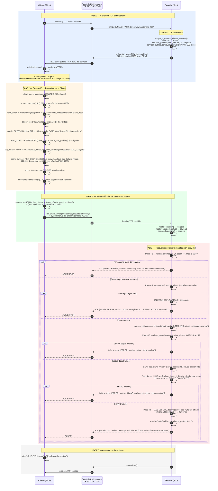
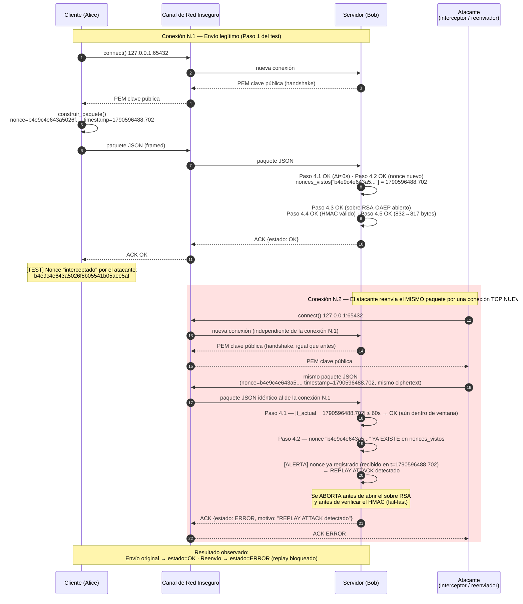

# Diagrama de secuencia — Protocolo seguro tipo TLS simplificado

**Actividad 1: Comunicación segura entre cliente y servidor — Parte III**
Implementación real: `src/servidor_protocolo.py`, `src/cliente_protocolo.py`, `src/red_utils.py`

Este documento contiene dos diagramas de secuencia en sintaxis Mermaid:

1. **Diagrama 1** — Flujo completo del protocolo en un intercambio legítimo (Fases 1 a 5).
2. **Diagrama 2** — Subflujo de ataque de repetición (*replay attack*), con los valores reales de nonce y timestamp capturados en `tests/test_ataque_repeticion.py`.

Ambos diagramas usan tres/cuatro participantes: **Cliente (Alice)**, el **Canal de Red Inseguro** (socket TCP sobre `127.0.0.1:65432`) y el **Servidor (Bob)**; el segundo diagrama añade un **Atacante** que reutiliza un paquete interceptado.

---

## Diagrama 1 — Intercambio legítimo completo

---

## Diagrama 2 — Subflujo: ataque de repetición (*replay attack*)

Valores reales capturados en `tests/test_ataque_repeticion.py`:
`nonce = b4e9c4e643a5026f8b05541b05aee5af`, `timestamp = 1790596488.702`.

### Notas de lectura del diagrama

- El **Paso 4.2 se evalúa antes que el 4.3, 4.4 y 4.5**: el servidor descarta un paquete repetido sin gastar ciclos de CPU en RSA, HMAC ni AES, y sin exponer ningún oráculo criptográfico al atacante.
- El nonce se registra en la caché **inmediatamente después** de pasar la validación (línea `nonces_vistos[nonce] = timestamp`), no al final del procesamiento: esto cierra la ventana de carrera ante dos reenvíos casi simultáneos.
- La ventana de tolerancia de 60 segundos por sí sola **no** habría bloqueado este replay (el reenvío ocurrió ~1 segundo después, dentro de la ventana); la detección efectiva la realiza el control de nonce.
